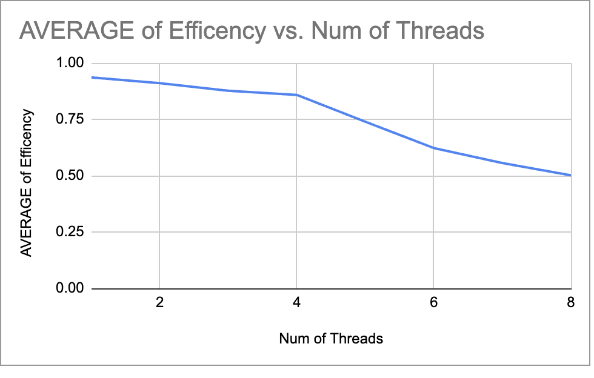
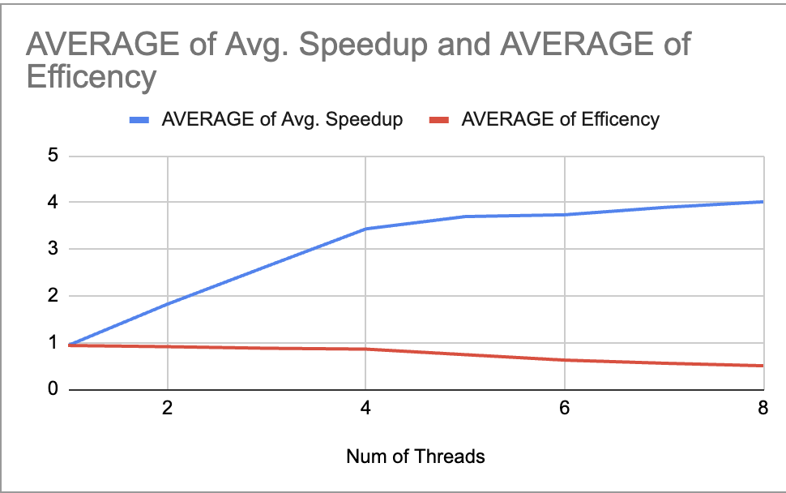
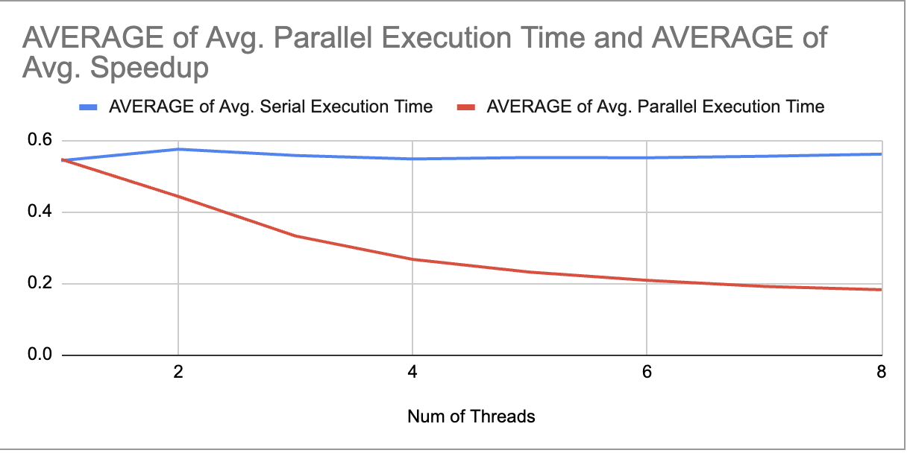
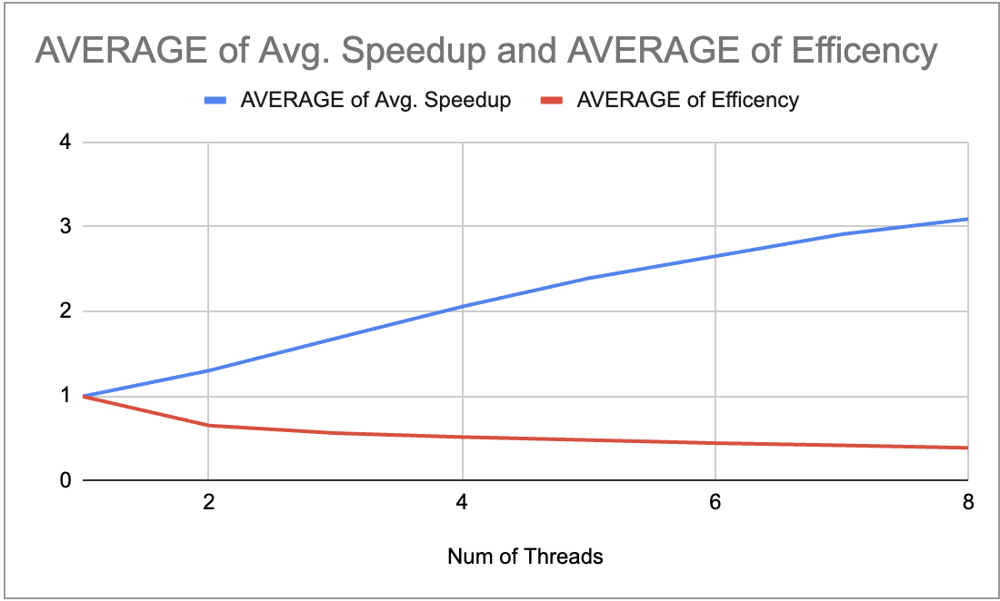
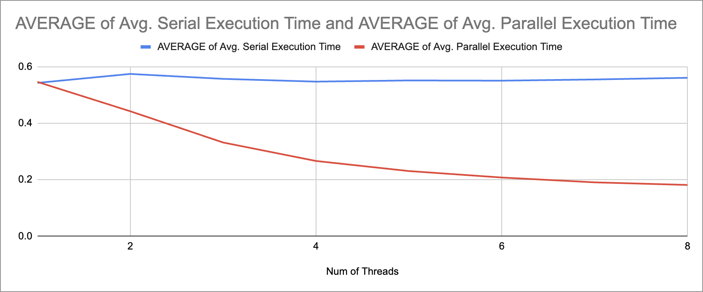

# Assignment 2: Fun with OpenMP
* CS 616: High Performance Computing
* Noah Fuery
* Professor Rene German
* October 8th 2023

## Compiling and Running Instructions
g++ matrix_mult.cpp -fopenmp -o mult.out
./mult.out
g++ matrix_trans.cpp -fopenmp -o trans.out
./trans.out

----------------
## 1. Introduction
This assignment seeks to utilize parallel programming through the use of OpenMP to demonstrate the performance benefits, as well as the potential drawbacks when compared to serial programming. Two different programs were created, one performing matrix multiplication and one performing matrix transposition.

-------------------------
## 2. Matrix Multiplication
### 2.1 Serial Implementation
   > The serial matrix multiplication code defines a function serialMult that performs matrix multiplication sequentially. It uses three nested loops to iterate through the rows of mat1, the columns of mat2, and the common dimension k. For each element (i, j) in the result matrix, it accumulates the result of the dot product of the corresponding rows and columns from mat1 and mat2.

### 2.2 Parallel Implementation
   > The parallel implementation is the same as the serial code except for the #prgama omp parallel for directive. The #pragma omp parallel for directive is used to parallelize the outer loop, which iterates through the rows of the result matrix. Inside the parallel region, each thread works on a subset of the rows, and then there are nested loops for the columns and the common dimension k. Each thread accumulates its partial results in the result matrix. The timer measures the execution time, and the result is printed to the console.

### 2.3 Performance Analysis
   > The three following graphs are the results of performing an analysis with the matrix multiplication serial and parallel methods. Each method was called 3 times for a certain number of threads, starting from one and continuing up to eight threads. N was set to 1000 for every run of the program. The maximum number of threads the computer testing the program had was 8, so that was the ending point. After testing and recording all the serial and parallel times, the speedup and efficiency were calculated using the average serial time and average parallel time. As seen in the Efficiency vs Number of Threads graph, the efficiency of the program dwindled as the number of threads was increased. This is most likely because the more threads were added, the less useful adding more became because the program was not complex enough for that many threads to be efficient. The average speedup and efficiency vs Number of Threads graph depicts speedup increasing as the number of threads increases, but efficiency dwindles at concurrently. This is the obvious result of increasing the number of threads because the program will run faster with more threads to split up the task at hand. The final graph, average serial time vs average parallel time, shows that the average serial time stays the same, while parallel time decreases rapidly as the number of threads increases. This points to the conclusion that increasing the number of threads allows for better parallelization, which in turn improves speedup time.

-------------------------
## 3. Matrix Transposition
### 3.1 Serial Implementation
   > Describe the implementation of the serial matrix transposition algorithm.

### 3.2 Parallel Implementation
   > Explain how you parallelized the matrix transposition algorithm using OpenMP. Address race conditions and correctness.

### 3.3 Performance Analysis
   > The three following graphs are the results from performing an analysis with the matrix transposition serial and parallel methods. Each method was called 3 times for a certain number of threads, starting from one and continuing up to eight threads. N was set to 10000 for every run of the program. After testing and recording all the serial and parallel times, the speedup and efficiency were calculated using the average serial time and average parallel time. As seen in the Efficiency vs Number of Threads graph, the efficiency of the program dwindled as the number of threads was increased. Unlike the matrix multiplication graph, the drop is a lot sharper initially in efficiency as threads are added. The average speedup and efficiency vs Number of Threads graph depicts speedup increasing as the number of threads increases, but efficiency dwindles at concurrently. The increase of speedup is linear on the graph, when compared to the matrix multiplication graph it is a lot smoother in its increase where as the speedup of the matrix multiplication graph slowed down after 4 threads. The final graph, average serial time vs average parallel time, shows that the average serial time stays the same, while parallel time decreases rapidly as the number of threads increases. This points to the conclusion that increasing the number of threads allows for better parallelization, which in turn improves speedup time.

# 4. Conclusion
> This assignment provided valuable insights into the practical application of OpenMP for parallel programming. The analysis revealed that increasing the number of threads can improve parallelization and speedup, but it may lead to diminishing efficiency returns in less complex programs. The choice of the number of threads and scheduling strategies should be carefully considered to optimize performance for specific tasks. Overall, parallel programming with OpenMP offers significant potential for enhancing the performance of computational tasks.
